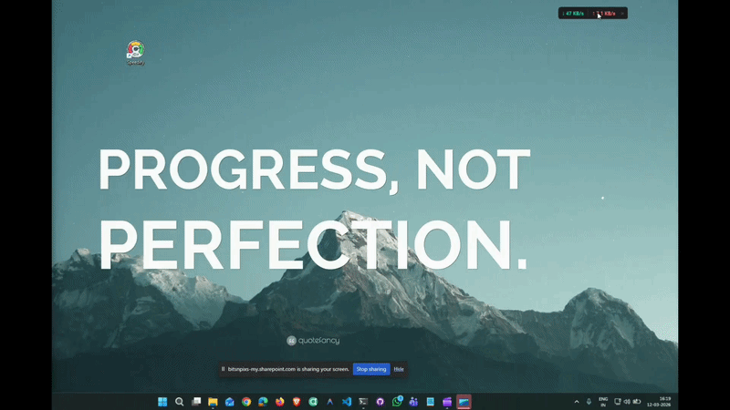

# Speedify — Network Speed Monitor

<p align="center">
  
  
  
  
</p>

<p align="center">
  
  
  
  
</p>

> A minimal, always-on-top network speed monitor that sits quietly on your desktop as a sleek, borderless pill-shaped overlay — showing real-time download and upload speeds at a glance.

<p align="center">
  <a href="https://bnp-aswin.github.io/speedify2/">🌐 Landing Page</a> &nbsp;·&nbsp;
  <a href="https://github.com/bnp-aswin/speedify2/releases">Releases</a> &nbsp;·&nbsp;
  <a href="https://github.com/bnp-aswin/speedify2/issues">Report Issue</a>
</p>

<p align="center">
  <a href="https://github.com/bnp-aswin/speedify2/releases/latest/download/Speedify-Setup.exe">
    
  </a>
</p>

> [!NOTE] Click the button above to download the latest Windows installer directly. No Python installation required.

---

## ✨ Features

- 📊 **Real-time monitoring** — Live download (↓) and upload (↑) speeds, updated every second
- 🧮 **Adaptive units** — Automatically switches between KB/s, Mbps, and Gbps
- 💊 **Pill-shaped overlay** — Borderless, transparent glassmorphism-style window
- 🎯 **Always on top** — Stays visible above all other applications (toggleable)
- 🖱️ **Draggable** — Click and drag to reposition anywhere on screen
- 💾 **Persistent position** — Remembers where you left it between sessions
- 🎨 **Dynamic color tinting** — Colors intensify as speeds increase
- ⚡ **Lightweight** — Minimal CPU and memory footprint

---

## 📸 Preview

<p align="center">
  
</p>

> Demo shows real-time speed updates, drag-to-reposition, and transparency effect.
> *(Replace `docs/preview.gif` with an actual screen recording to display the demo.)*

| Element        | Detail                                      |
| -------------- | ------------------------------------------- |
| Window Size    | Auto-sizing pill (~32px tall)               |
| Download color | Teal `#00D4AA`                              |
| Upload color   | Coral `#FF6B6B`                             |
| Background     | Dark `#1e1e1e` with chroma-key transparency |
| Font           | Segoe UI Bold 10pt                          |

---

## 🚀 Getting Started

### Prerequisites

- Python 3.6 or higher
- pip

### Installation

```bash
# Clone the repository
git clone https://github.com/bnp-aswin/speedify2
cd speedify

# Install dependencies
pip install -r requirements.txt
```

### Run

```bash
python speedify.py
```

---

## 🎮 Usage

| Action                   | How                                 |
| ------------------------ | ----------------------------------- |
| **Move** the window      | Click and drag anywhere on the pill |
| **Close**                | Click the `×` button                |
| **Toggle Always on Top** | Right-click → _Always on Top_       |
| **Reset Position**       | Right-click → _Reset Position_      |

---

## 📋 Requirements

```
psutil>=5.8.0
```

Tkinter is included with Python's standard library — no extra install needed.

---

## 🔧 Technical Details

| Component       | Technology                               |
| --------------- | ---------------------------------------- |
| GUI Framework   | Tkinter (Python standard library)        |
| Network Stats   | `psutil`                                 |
| Threading       | `threading.Thread` (daemon)              |
| Transparency    | Windows chroma-key via `wm_attributes`   |
| Speed Averaging | 8-sample sliding window                  |
| Config Storage  | JSON in `%APPDATA%\Speedify\config.json` |

---

## 📁 Project Structure

```
speedify2/
├── speedify.py        # Main application
├── installer.py       # Installer script
├── build.bat          # Build script (PyInstaller)
├── speedify.spec      # PyInstaller spec
├── installer.spec     # Installer PyInstaller spec
├── network_icon.ico   # App icon
├── requirements.txt   # Python dependencies
├── CONTRIBUTING.md    # Contributor guide
├── docs/
│   └── preview.gif    # Demo screen recording (placeholder)
├── .github/
│   └── ISSUE_TEMPLATE/
│       ├── bug_report.md
│       └── feature_request.md
└── README.md
```

---

## 🏗️ Building an Executable

A `build.bat` and PyInstaller spec are included to package the app as a standalone `.exe`.

```bash
build.bat
```

The output will be in the `dist/` folder.

---

## 📄 License

This project is open source and available under the [MIT License](LICENSE).

---

<p align="center">Made with ❤️ using Python + Tkinter</p>
